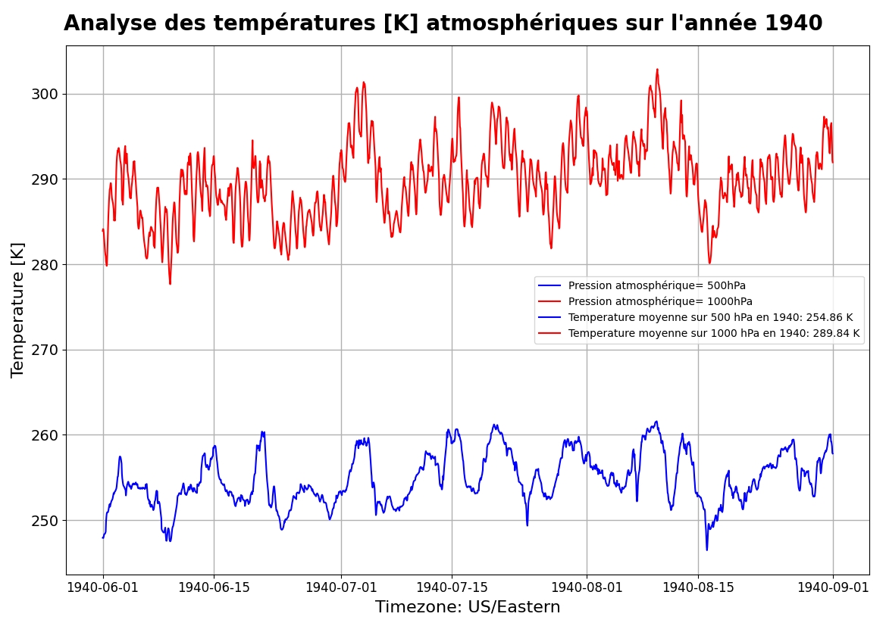
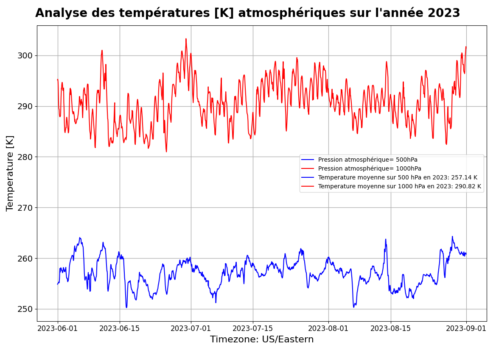

# Projet Hackathon pour les observations des prévisions de la température atmosphérique

Objectif principal:  Déterminer les observations sur les données de température atmosphérique pour améliorer le sentinel 4 sur les mesures climatiques à travers le monde. <br>
Problématique: Connaître le niveau du réchauffement climatique sur l'évolotion de la température <br>

## Installation

Assurez-vous d'avoir la bibliothèque netCDF4 installée. Vous pouvez l'installer en exécutant la commande suivante :

```bash
pip install netCDF4 matplotlib pandas numpy

## Utilisation 

1- Placez vos fichiers NetCDF dans le répertoire spécifié dans le script.
2- Modifiez les paramètres de latitude et de longitude selon la zone géographique qui vous intéresse.
3- Exécutez le script Python.

python script.py

## Fonctionnalités

Fonctionnalités
Sub-region-extraction: Le script permet l'extraction de sous-régions spécifiques en ajustant les paramètres de latitude et de longitude.

Visualisation: Le script génère des graphiques temporels pour les températures atmosphériques à différentes pressions (500hPa et 1000hPa).

Calcul de moyenne: Il calcule automatiquement la température moyenne à différentes pressions pour l'année spécifiée.

## Configuration de la Zone Géographique

Vous pouvez personnaliser la zone géographique en modifiant les paramètres suivants dans le script :

# Sub-region-extraction:
North = 60
West = -108
East = -20
South = -90 

## Résultats

&nbsp;  &nbsp; &nbsp;   <br>
<center> <b> Conséquences de réchauffement climatique  à l’année 1940 et  2023 pour la période d’été </b> </center> <br> 
<b> LISTES DES PARTICIPANTS  </b> <br> <br> 
   
| NOM  | PRENOM |
|  ------ | ------ |
|TRAN|Vincent|
|DIOUF|Sylvain|
|AARAB|Yasmine|
|CHANSUK|Chatri|
|HOUNMENOU|Moise|


